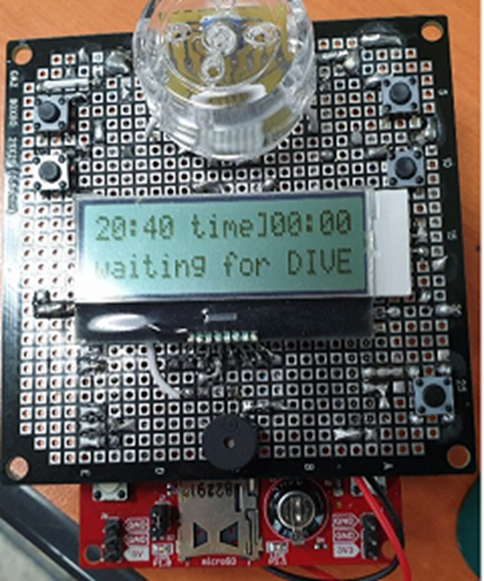
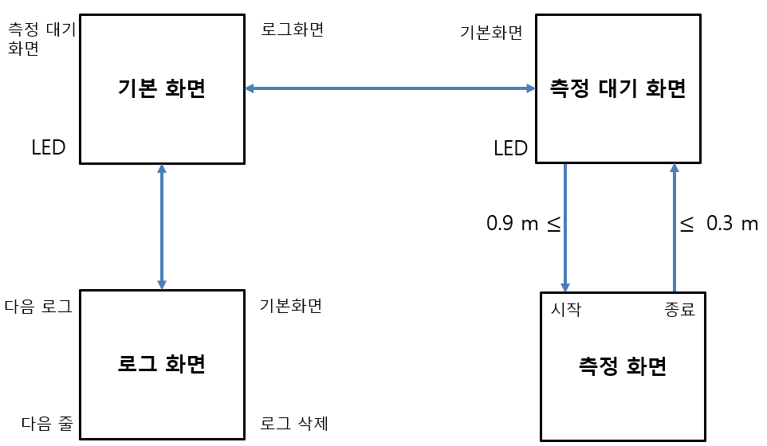
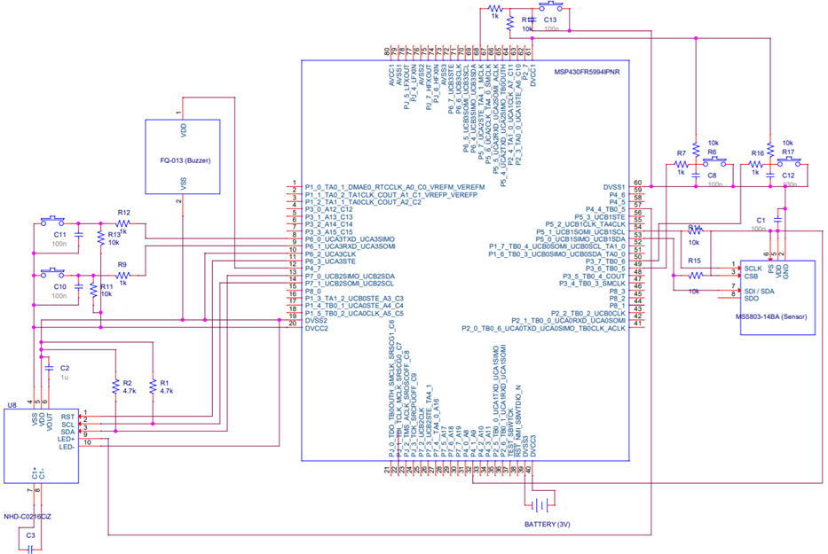
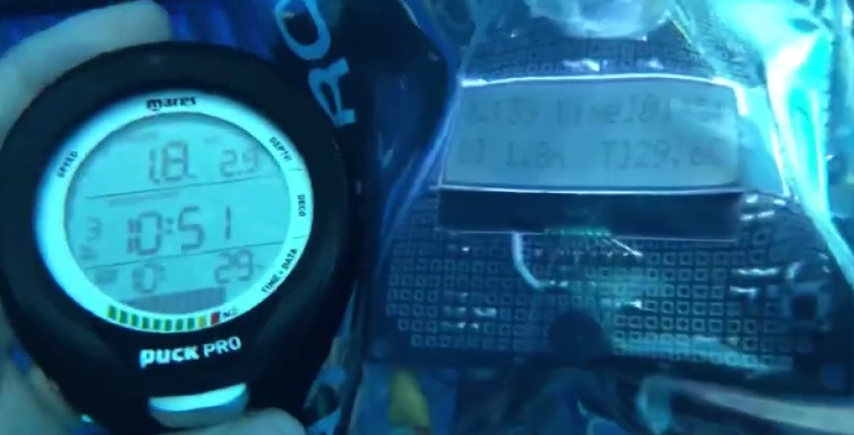

# Diving-Computer
Diving Computer Embedded System Using MSP430FR5994

# Description

MSP430FR5994를 이용해 만든 다이빙 컴퓨터

# Algorithm

기본적인 구동방식: 4개의 버튼을 이용하여 모드 변경이 가능하다.

측정모드: 수심 90cm 이상이 된 경우 자동 측정 시작, 수심 30cm 이하가 된 경우 자동 측정 종료

로그모드: 최대 30개 까지의 로그를 저장 및 조회 가능

(CCS Directory에서 자세한 Code 조회 가능)

# Circuit

ORCAD를 이용해 구성한 회로도

# Result

마레스 퍽프로와 비교하여 실 성능 측정. (오차 10 ~ 30cm)
